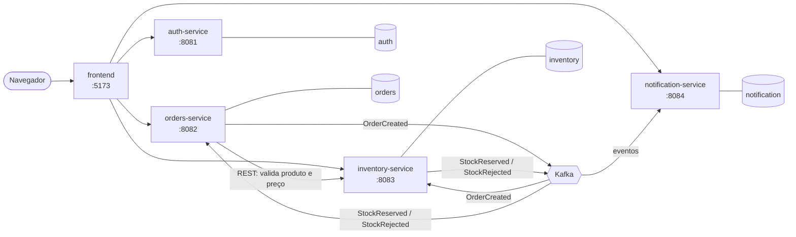

# ecommerce-microservices-java

[](https://github.com/Pedro-G-B-Azevedo/ecommerce-microservices-java/actions/workflows/ci.yml)

Sistema de e-commerce simplificado construído com arquitetura de microsserviços em
Java/Spring Boot, usando PostgreSQL (um banco por serviço), Kafka para comunicação
assíncrona e Docker para orquestração local.

Projeto pessoal de portfólio, desenvolvido em etapas incrementais.

## Arquitetura



O fluxo de criação de pedido é uma **saga coreografada**: o pedido nasce `PENDING`,
o `inventory-service` tenta reservar o estoque e publica o resultado, e o
`orders-service` consome esse retorno para concluir o pedido como `CONFIRMED` ou
`REJECTED`. Os consumidores são idempotentes (deduplicação por id do evento) e
falhas repetidas vão para um *dead-letter topic*.

## Stack

| Camada | Tecnologia |
| --- | --- |
| Linguagem | Java 17 |
| Framework | Spring Boot 3.5 (Web, Data JPA, Validation, Security, Actuator) |
| Persistência | PostgreSQL 16 + Hibernate, migrations com Flyway |
| Mensageria | Apache Kafka (modo KRaft, sem Zookeeper) |
| Comunicação síncrona | `RestClient` (Spring Framework 6) |
| Autenticação | Spring Security + JWT (RS256, via Nimbus), papéis `CLIENTE`, `ADMIN` e `SERVICE` |
| Documentação | springdoc-openapi (Swagger UI) |
| Observabilidade | Logs em JSON (logstash-logback-encoder), métricas Prometheus (Micrometer), id de correlação de ponta a ponta |
| Testes | JUnit 5, Mockito, Testcontainers, JaCoCo, testes ponta a ponta |
| Front-end | React 19 + TypeScript, Vite, React Router |
| Build | Maven multi-módulo (back-end), npm (front-end) |
| Infra local | Docker Compose |
| CI/CD | GitHub Actions (build, scan de vulnerabilidades, publicação de imagens no GHCR) |

## Estrutura do repositório

```
.
├── pom.xml                  # POM pai: versões, plugins e módulos
├── contracts/               # Contratos dos eventos Kafka (compartilhado)
├── auth-service/            # Usuários, papéis e emissão de JWT
├── orders-service/          # Criação e consulta de pedidos
├── inventory-service/       # Estoque e reserva de itens
├── notification-service/    # Notificações a partir dos eventos
├── frontend/                # SPA em React que consome as quatro APIs
├── docker-compose.yml       # Infraestrutura local
└── .github/workflows/ci.yml # Pipeline de build e testes
```

Os serviços compartilham apenas o módulo `contracts`, que contém somente os
*records* dos eventos publicados no Kafka. Entidades JPA, regras de negócio e
DTOs de API **não** são compartilhados: cada serviço é dono do seu domínio e do
seu banco. O `frontend` não participa do reactor Maven: é um projeto npm à parte,
que fala com os quatro serviços por HTTP, do mesmo jeito que qualquer outro
cliente externo falaria.

## Como executar

### Pré-requisitos

- JDK 17 ou superior
- Node 22 ou superior (só para rodar o front-end fora do Docker)
- Docker e Docker Compose
- Não é necessário instalar o Maven: use o wrapper (`./mvnw`)

### Subir tudo

```bash
cp .env.example .env     # ajuste usuários e senhas
docker compose up -d --build
```

Sobe os quatro serviços, seus bancos, o Kafka e o front-end. As dependências são
declaradas por `healthcheck`, não por ordem de inicialização: o `orders-service`
só começa depois que o banco aceita conexões, o Kafka responde e o `auth-service`
está de pé para servir a chave pública. O front-end fica em
http://localhost:5173 — veja a conta de administrador padrão em
[Autenticação e autorização](#autenticação-e-autorização).

Para subir apenas a infraestrutura e rodar os serviços pela IDE:

```bash
docker compose up -d auth-db orders-db inventory-db notification-db kafka
```

Cada serviço sobe um PostgreSQL próprio:

| Serviço | Banco | Porta do host |
| --- | --- | --- |
| auth-service | `auth` | 5433 |
| orders-service | `orders` | 5434 |
| inventory-service | `inventory` | 5435 |
| notification-service | `notification` | 5436 |

### Build e testes

```bash
./mvnw verify
```

> Os testes usam **Testcontainers** e sobem um PostgreSQL real, portanto o Docker
> precisa estar em execução. As migrations Flyway e o mapeamento Hibernate são
> validados contra o mesmo banco usado em produção — nada de H2.

### Rodar um serviço

```bash
./mvnw -pl orders-service spring-boot:run
```

| Serviço | Porta | Swagger UI |
| --- | --- | --- |
| auth-service | 8081 | http://localhost:8081/swagger-ui.html |
| orders-service | 8082 | http://localhost:8082/swagger-ui.html |
| inventory-service | 8083 | http://localhost:8083/swagger-ui.html |
| notification-service | 8084 | http://localhost:8084/swagger-ui.html |

Cada serviço expõe também `/actuator/health`, `/actuator/info` e `/actuator/metrics`.

As credenciais de banco são lidas de variáveis de ambiente
(`ORDERS_DB_URL`, `ORDERS_DB_USER`, `ORDERS_DB_PASSWORD`, e equivalentes para os
demais serviços), com valores padrão apontando para o `docker-compose.yml`.

## API do orders-service

| Método | Rota | Descrição |
| --- | --- | --- |
| `POST` | `/api/v1/orders` | Cria um pedido (`201` + `Location`). O total é calculado a partir dos itens. |
| `GET` | `/api/v1/orders/{id}` | Busca um pedido com seus itens. |
| `GET` | `/api/v1/orders` | Lista pedidos, com filtros opcionais `customerId` e `status` e paginação. |
| `POST` | `/api/v1/orders/{id}/cancel` | Cancela um pedido que ainda esteja pendente. |

Erros seguem RFC 7807:

```json
{
  "type": "https://api.ecommerce.com/problems/invalid-order-state",
  "title": "Transição de status inválida",
  "status": 409,
  "detail": "Apenas pedidos pendentes podem ser cancelados; status atual: CANCELLED",
  "instance": "/api/v1/orders/edad184c-47e6-4ceb-822f-b578c0910a3c/cancel",
  "timestamp": "2026-01-15T10:00:00Z"
}
```

O corpo da criação traz apenas `productId` e `quantity`. **O preço não faz parte
do contrato**: o orders-service consulta o catálogo do inventory-service, em uma
única chamada em lote, e grava o preço vindo de lá. Aceitá-lo do cliente
permitiria que ele definisse quanto paga.

A integração distingue dois tipos de falha:

| Situação | Status | Por quê |
| --- | --- | --- |
| Produto inexistente ou inativo | `422` | O corpo está bem formado, mas referencia algo que o catálogo não vende. A resposta lista todos os ids problemáticos. |
| inventory-service fora do ar ou lento | `503` | É falha de infraestrutura, não do pedido: repetir mais tarde pode dar certo. |

Os tempos-limite da chamada são curtos (2s para conectar, 3s para ler): a criação
de pedido é síncrona, e uma chamada pendurada seguraria a thread e o cliente junto.

O `customerId` não faz parte do corpo: é o `sub` do token. Aceitá-lo permitiria
criar pedidos em nome de outra pessoa.

## API do inventory-service

| Método | Rota | Descrição |
| --- | --- | --- |
| `POST` | `/api/v1/products` | Cadastra um produto e abre sua linha de estoque. |
| `GET` | `/api/v1/products/{id}` | Busca um produto. |
| `GET` | `/api/v1/products/by-ids?ids=` | Consulta em lote, usada pelo orders-service. |
| `GET` | `/api/v1/products` | Lista produtos, com busca textual e filtro por situação. |
| `GET` | `/api/v1/products/{id}/stock` | Consulta disponível e reservado. |
| `POST` | `/api/v1/products/{id}/stock/replenish` | Dá entrada de estoque. |
| `POST` | `/api/v1/reservations` | Reserva estoque para um pedido (tudo ou nada, idempotente). |
| `GET` | `/api/v1/reservations/{orderId}` | Consulta a reserva de um pedido. |
| `POST` | `/api/v1/reservations/{orderId}/confirm` | Confirma: as unidades saem do estoque. |
| `POST` | `/api/v1/reservations/{orderId}/release` | Libera: as unidades voltam para disponível. |

O estoque tem duas quantidades: `availableQuantity`, o que pode ser vendido agora,
e `reservedQuantity`, o que já foi separado para pedidos ainda não resolvidos.
Reservar move unidades de uma para a outra; confirmar tira as reservadas de vez;
liberar as devolve.

Reservar usa `SELECT ... FOR UPDATE` sobre a linha de estoque. Sem isso, duas
requisições simultâneas leriam a mesma disponibilidade e ambas reservariam,
vendendo estoque que não existe. As linhas são travadas sempre na mesma ordem
(por id do produto), o que elimina a chance de deadlock entre pedidos que
compartilham produtos.

## A saga de estoque

```
orders                          Kafka                        inventory
  │                               │                              │
  ├─ grava pedido (PENDING) ──┐   │                              │
  │                        commit │                              │
  ├─ publica OrderCreated ────────┤                              │
  │                               ├──── OrderCreated ───────────>│
  │                               │                              ├─ reserva estoque
  │                               │<─ StockReserved / Rejected ──┤
  │<──────────────────────────────┤                              │
  ├─ CONFIRMED ou REJECTED        │                              │
```

O que sustenta esse fluxo:

**A publicação só acontece depois do commit.** `OrderService` dispara um evento
interno do Spring dentro da transação, e `OrderEventPublisher` o envia ao Kafka em
`@TransactionalEventListener(AFTER_COMMIT)`. Publicar antes anunciaria um pedido que
ainda pode sofrer rollback, e o inventory separaria estoque para algo que nunca
existiu.

**Resta uma janela conhecida.** Se o processo cair entre o commit e o envio, o
pedido fica `PENDING` sem que o evento saia. É o custo consciente de não usar o
padrão *outbox*, que gravaria o evento na mesma transação e o publicaria a partir
da tabela. É o próximo passo natural caso o projeto evolua.

**Consumo idempotente nos dois lados.** A entrega do Kafka é *at-least-once*: o
mesmo evento chega mais de uma vez, por exemplo quando o consumidor cai depois de
processar e antes de confirmar o offset. No inventory, a unique key
`(order_id, product_id)` e a checagem por pedido impedem reservar duas vezes. No
orders, a tabela `processed_events` tem o `eventId` como chave primária, e o
registro é gravado na mesma transação da mudança de status — ou as duas coisas
valem, ou nenhuma.

**Falha de negócio não é erro.** Estoque insuficiente é um desfecho: vira
`StockRejected`, não exceção. Reprocessar não mudaria o resultado, então a mensagem
não vai para o dead-letter topic. Já uma falha técnica sobe, é repetida três vezes
com um segundo de intervalo e, se persistir, vai para o DLT — sem isso, uma
mensagem que sempre falha trava a partição e impede o avanço de todos os pedidos
seguintes.

**Cancelamento durante a reserva é compensado.** Se o cliente cancela enquanto o
inventory separa o estoque, o `StockReserved` chega para um pedido já cancelado. O
pedido não volta atrás: o que se desfaz é a reserva, com uma chamada de liberação
ao inventory-service.

**A chave da mensagem é o id do pedido**, o que mantém todos os eventos de um mesmo
pedido na mesma partição e, portanto, em ordem.

### Tópicos

| Tópico | Produtor | Consumidor |
| --- | --- | --- |
| `orders.order-created` | orders-service | inventory-service |
| `inventory.stock-reserved` | inventory-service | orders-service |
| `inventory.stock-rejected` | inventory-service | orders-service |

Os contratos vivem no módulo `contracts`, compartilhado pelos serviços. É a única
coisa que eles compartilham — e é justamente o que garante que produtor e consumidor
concordem sobre o formato.

## O notification-service

Consumidor puro: não participa da saga e não influencia o resultado do pedido.
Assina os três tópicos em um grupo próprio, então uma falha aqui não afeta o
`orders` nem o `inventory`.

| Evento | Notificação |
| --- | --- |
| `OrderCreated` | "Recebemos o seu pedido" |
| `StockReserved` | "Seu pedido foi confirmado" |
| `StockRejected` | "Não conseguimos atender o seu pedido", detalhando cada item em falta |

O envio é simulado: `LoggingNotificationSender` escreve a mensagem no log em vez de
entregá-la. É uma implementação de `NotificationSender`, de modo que trocar o log
por um provedor real não exige tocar no serviço nem nos listeners.

Duas decisões valem o comentário:

**O serviço monta seu próprio modelo de leitura.** Os eventos de estoque trazem
apenas o pedido — o inventory-service não conhece o cliente, e fazê-lo repassar esse
dado o obrigaria a carregar informação que não é dele. Em vez disso, a tabela
`order_contacts` é preenchida a partir de `OrderCreated` e consultada quando o
desfecho chega. Se o desfecho chegar antes (Kafka só garante ordem dentro de uma
partição, e são tópicos diferentes), a exceção sobe, o Kafka reentrega e a tentativa
seguinte encontra o cadastro.

**Falha de envio não derruba o consumo.** A notificação é gravada como `FAILED`,
com o motivo, e o evento segue processado. Deixar a exceção subir faria o Kafka
reentregar o evento e reenviar a mensagem para quem já a recebeu — pior do que
registrar a falha e seguir.

A API é somente leitura: `GET /api/v1/notifications`, com filtros por pedido,
cliente e situação. Notificações nascem do consumo de eventos, nunca de uma chamada.

## Autenticação e autorização

O `auth-service` emite tokens JWT; os outros três os validam como *resource servers*.

**Assinatura assimétrica (RS256), não segredo compartilhado.** Com HS256 e um
segredo único, todo serviço capaz de validar um token também seria capaz de emitir
um — um serviço comprometido poderia forjar credenciais de administrador. Aqui só o
`auth-service` tem a chave privada; os demais buscam a pública em
`/.well-known/jwks.json` e nunca conseguem assinar nada.

O `sub` do token é o id do usuário, não o e-mail: é o que os outros serviços usam
como `customerId`, e não muda se o e-mail mudar.

**Conta de administrador padrão.** Na primeira subida, o `auth-service` cria uma
conta `ADMIN` a partir de `AUTH_ADMIN_EMAIL`/`AUTH_ADMIN_PASSWORD`
(`admin@ecommerce.local` / `troque-esta-senha-admin` por padrão — troque-os fora
de desenvolvimento). É com ela que se entra no painel administrativo do
front-end para cadastrar produtos; qualquer outra conta nasce `CLIENTE`.

### Quem pode o quê

| Recurso | Anônimo | `CLIENTE` | `ADMIN` | `SERVICE` |
| --- | --- | --- | --- | --- |
| `GET /products/**` | ✅ | ✅ | ✅ | ✅ |
| `POST/PUT /products/**` | 401 | 403 | ✅ | 403 |
| `/reservations/**` | 401 | 403 | ✅ | ✅ |
| `POST /orders` | 401 | ✅ | 403 | 403 |
| `GET /orders/{id}` | 401 | só os próprios | todos | 403 |
| `GET /orders` | 401 | só os próprios | todos | 403 |
| `GET /notifications` | 401 | só as próprias | todas | 403 |

O catálogo é público de propósito: numa loja, navegar por produtos e preços não
exige conta. Criar pedido é exclusividade de `CLIENTE` — um administrador não compra
em nome de ninguém.

**O filtro por cliente é imposto, não aceito.** Nas listagens, o parâmetro
`customerId` só tem efeito para `ADMIN`; para um cliente, ele é substituído pelo
`sub` do token. Sem isso, bastaria informar outro id para ler os pedidos alheios.

**Pedido de outra pessoa devolve 404, não 403.** Confirmar que o pedido existe, mas
pertence a outro cliente, já é informação que o solicitante não deveria obter.

**O login não distingue os motivos da falha.** E-mail inexistente, senha errada e
conta desativada devolvem a mesma mensagem; diferenciá-las permitiria descobrir
quais e-mails têm conta. O cadastro com e-mail já usado segue a mesma regra.

### Identidade de serviço

A compensação da saga — liberar uma reserva quando o pedido foi cancelado — nasce de
um evento do Kafka, onde não há usuário autenticado para repassar. E propagar o token
do cliente seria errado: quem pede a liberação é o serviço, não a pessoa. Por isso o
`orders-service` tem uma conta própria, com o papel `SERVICE`, e obtém um token no
`auth-service` que mantém em memória até pouco antes de expirar.

### Chaves

As chaves RSA vêm em PEM por `JWT_PRIVATE_KEY` e `JWT_PUBLIC_KEY`. Quando não vêm, o
`auth-service` gera um par efêmero ao subir e registra um aviso: conveniente em
desenvolvimento, inviável em produção, onde reiniciar invalidaria todos os tokens em
circulação.

As contas de administrador e de serviço são criadas na primeira subida a partir de
configuração (`auth.bootstrap`), e não semeadas numa migration com hash de senha
fixo no repositório. **As senhas padrão do `.env.example` servem só para o
docker-compose local.**

## Documentação das APIs

Cada serviço publica sua própria especificação OpenAPI 3.1 e uma interface Swagger:

| Serviço | Swagger UI | Especificação |
| --- | --- | --- |
| auth-service | http://localhost:8081/swagger-ui.html | `/v3/api-docs` |
| orders-service | http://localhost:8082/swagger-ui.html | `/v3/api-docs` |
| inventory-service | http://localhost:8083/swagger-ui.html | `/v3/api-docs` |
| notification-service | http://localhost:8084/swagger-ui.html | `/v3/api-docs` |

Para experimentar as rotas protegidas: obtenha um token em
`POST /api/v1/auth/login` no auth-service, clique em **Authorize** no Swagger do
serviço desejado e cole apenas o token — o prefixo `Bearer` é acrescentado pela
interface.

O esquema de segurança está declarado por operação, e não no serviço inteiro: no
inventory-service, por exemplo, as quatro leituras de catálogo aparecem abertas e as
seis operações restantes aparecem com cadeado. A documentação reflete as regras que
o `SecurityFilterChain` realmente aplica.

## Front-end

Uma SPA em React 19 + TypeScript (Vite) que cobre a jornada do cliente — catálogo,
carrinho, checkout, acompanhamento do pedido e notificações — mais um painel
administrativo simples para cadastrar produtos e dar entrada de estoque. Vive em
`frontend/`, fora do reactor Maven: é um projeto npm à parte, que fala com os
quatro serviços por HTTP como qualquer outro cliente externo falaria — sem
backend-for-frontend, sem SSR.

```bash
cd frontend
npm install
npm run dev          # http://localhost:5173, falando com os serviços em localhost:808x
```

**Sem API gateway.** O navegador chama cada serviço diretamente na sua porta; as
URLs vêm de variáveis `VITE_*` (`src/api/config.ts`), com portas locais como
padrão. Isso empurrou duas coisas para o back-end que não existiam antes deste
passo: CORS (cada serviço libera a origem do front-end via `CORS_ALLOWED_ORIGINS`,
com `X-Correlation-Id` na lista de cabeçalhos expostos — sem isso o `fetch` do
navegador não teria como lê-lo) e um pouco de decisão de UX no cliente, como o
polling da página de pedido: a saga confirma ou rejeita de forma assíncrona, então
a tela consulta o pedido a cada poucos segundos enquanto ele estiver `PENDING`.

**Sessão em `localStorage`, não cookie httpOnly.** Mais simples para uma SPA sem
backend-for-frontend, ao custo de expor o token a um XSS bem-sucedido — uma troca
aceitável aqui porque não há conteúdo de terceiros na página; em produção real, a
alternativa seria um cookie httpOnly emitido pelo próprio backend-for-frontend, o
que reintroduziria a peça que este projeto deliberadamente não tem.

**Sem testes automatizados de front-end.** Este passo é opcional e o rigor de
testes do projeto está deliberadamente concentrado no back-end (JUnit, Mockito,
Testcontainers, o teste ponta a ponta). A jornada completa — cadastro, login,
busca no catálogo, checkout, confirmação da saga, notificações, rejeição por
estoque insuficiente e a guarda de rota do painel administrativo — foi verificada
manualmente contra os quatro serviços reais, incluindo um bug real de condição de
corrida encontrado e corrigido nesse processo (respostas do polling do pedido
podiam chegar fora de ordem e sobrescrever um status já confirmado com um
`PENDING` desatualizado; a correção descarta qualquer resposta que não seja a da
requisição mais recente).

## As imagens

Cada serviço tem um `Dockerfile` multi-estágio na sua pasta. O build é feito a
partir da **raiz do repositório**, porque é um projeto Maven multi-módulo e cada
serviço depende do POM pai e do módulo `contracts`:

```bash
docker build -f orders-service/Dockerfile -t ecommerce/orders-service .
```

Três decisões:

**Os POMs são copiados antes do código.** Enquanto as dependências não mudarem, o
Docker reaproveita a camada de download mesmo quando o código muda — o que separa um
rebuild de segundos de um de minutos.

**O jar é desmontado em camadas** (`jarmode=tools ... extract --layers`). Dependências,
loader e aplicação viram camadas distintas da imagem, então um deploy que só mudou
código reenvia poucos megabytes em vez do jar inteiro.

**O processo não roda como root.** A imagem final é um JRE Alpine com um usuário
`spring` sem privilégios, e a memória é limitada por `MaxRAMPercentage` em vez de um
`-Xmx` fixo, para que a JVM respeite o limite do container qualquer que seja ele.

O CI constrói as quatro imagens a cada push e falha se alguma delas acabar rodando
como root.

**O front-end tem seu próprio `Dockerfile`** (`frontend/Dockerfile`), fora desse
padrão: build em duas etapas também, mas a primeira roda `npm ci`/`npm run build`
em vez do Maven, e a segunda serve os arquivos estáticos com a imagem
`nginx-unprivileged` — sem root aqui também, só que via um Nginx que já roda como
usuário sem privilégios por padrão, em vez de um usuário criado à mão. As URLs das
APIs (`VITE_*`) entram como build arg, porque o Vite as resolve em tempo de build:
o resultado é um bundle estático, sem servidor por trás capaz de injetar
configuração em tempo de execução.

## O pipeline de CI/CD

Um único workflow (`.github/workflows/ci.yml`), seis jobs. Os quatro voltados ao
back-end formam uma cadeia, cada um dependendo do anterior ter passado; o
`frontend` roda em paralelo, e o `e2e` builda e sobe o container do front-end
junto dos outros porque ele também está no `docker-compose.yml`:

```
build ──> images ──> security-scan ──> e2e ──> publish
                                        ^
frontend ───────────────────────────────  (typecheck + bundle; a imagem do
                                            front-end é validada pelo próprio e2e)
```

| Job | O que faz | Quando roda |
| --- | --- | --- |
| `build` | Testes unitários, web, persistência, mensageria e concorrência | Todo push e PR |
| `frontend` | `npm ci`, typecheck (`tsc -b`) e bundle de produção (`vite build`) | Todo push e PR |
| `images` | Builda as quatro imagens Spring; falha se alguma rodar como root | Todo push e PR |
| `security-scan` | Escaneia as quatro imagens Spring com Trivy | Todo push e PR |
| `e2e` | Sobe o `docker compose` completo (inclusive o front-end) e roda a jornada ponta a ponta do back-end | Todo push e PR |
| `publish` | Publica as quatro imagens Spring no GHCR | Só push em `main` |

**Por que o front-end fica de fora do scan e da publicação no GHCR.** O gate de
Trivy e o registro de imagens existem para o que este projeto trata como o
entregável real — os quatro serviços Spring; uma imagem estática do Nginx
servindo um bundle React tem uma superfície de risco muito menor e não muda com
a mesma frequência que justifique o mesmo aparato. O front-end ainda assim tem
sua build validada a cada push, só que pelo job `frontend` (typecheck + bundle) e
pela própria subida do `docker compose` no job `e2e` — se o `Dockerfile` dele
quebrar, o `e2e` quebra junto.

**O scan de vulnerabilidades é um gate real, não decorativo.** Ele falha o job
para CVE **crítico e corrigido rio acima** (`severity: CRITICAL`,
`ignore-unfixed: true`) — travar o pipeline por uma vulnerabilidade que a própria
distro de base ainda não corrigiu não protegeria ninguém, só impediria qualquer
deploy indefinidamente. Vulnerabilidades `HIGH` são reportadas no log sem travar
o build, como informação para quem for revisar.

**A publicação só acontece depois dos dois gates de qualidade**, e só a partir do
`main` — o `publish` depende de `security-scan` e de `e2e`, e um push numa branch
de feature (como as `claude/**` deste projeto) deixa o job como *skipped*, não
como falha. Cada imagem é publicada com duas tags:

```
ghcr.io/<owner>/<repo>/<serviço>:sha-<commit curto>
ghcr.io/<owner>/<repo>/<serviço>:latest
```

A tag pelo SHA torna todo deploy rastreável até o commit exato que o gerou; a
`latest` é o que aponta para o estado mais recente do `main`. Os três jobs de
build, scan e publish compartilham o cache do Buildx por serviço
(`cache-from`/`cache-to: type=gha`), então a imagem publicada é a mesma que
passou pelo scan — sem rebuild às cegas entre um job e outro.

## Os testes

| Camada | O que cobre | Como roda |
| --- | --- | --- |
| Unitários | Regras de negócio, com Mockito | `./mvnw test` |
| Web | Contratos HTTP e regras de autorização, com MockMvc | `./mvnw test` |
| Persistência | Mapeamento e constraints, contra PostgreSQL real | Testcontainers |
| Mensageria | A saga dos dois lados, contra Kafka real | Testcontainers |
| Concorrência | Duas reservas simultâneas não vendem o mesmo estoque | Testcontainers |
| Ponta a ponta | A jornada pelos quatro serviços | `docker compose` |

Os cinco primeiros rodam em `./mvnw verify`, no CI a cada push. Nada de H2 nem de
broker embutido: testar contra um banco diferente do de produção esconde
divergências de dialeto, tipo e migration.

### O teste ponta a ponta

É o único que exercita os quatro serviços juntos — autenticação, catálogo, pedido,
saga pelo Kafka e notificação. Os demais cobrem cada serviço isoladamente e não
pegariam uma divergência de contrato entre dois deles.

```bash
docker compose up -d --build
./mvnw -pl e2e-tests verify -Dskip.e2e=false
```

Fica desligado por padrão, porque exige a pilha no ar — `./mvnw verify` precisa
funcionar em qualquer máquina. No CI, um job dedicado sobe o compose e o executa.

O módulo `e2e-tests` **não depende de Spring nem de nenhuma classe dos serviços**:
fala HTTP puro, como qualquer cliente externo. Se um contrato mudar, o teste quebra
— que é exatamente o que se espera dele.

## Observabilidade

Logs em JSON, métricas no formato Prometheus e um id de correlação que atravessa a
jornada inteira: uma requisição HTTP, dois saltos de Kafka e a chamada de volta
para renovar o token de serviço — tudo com o mesmo id, em todos os quatro
serviços.

### Logs

Cada serviço escreve um objeto JSON por linha (`logstash-logback-encoder`), com
`service`, `level`, `logger_name`, `message` e, quando existe, `correlationId`. É
o formato que uma stack real (Loki, ELK, CloudWatch Logs Insights) espera; sem
isso, achar "todo log do pedido X" num `docker compose logs` vira grep sobre
texto livre:

```json
{"@timestamp":"2026-01-15T10:00:00.123Z","message":"Pedido 45b4... confirmado",
 "logger_name":"com.ecommerce.orders.service.OrderSagaService","level":"INFO",
 "correlationId":"e2e-7f3a...","service":"orders-service"}
```

### Id de correlação

Um `CorrelationIdFilter` gera (ou reaproveita, se o cliente já mandou um) o id no
cabeçalho `X-Correlation-Id`, o põe no MDC — daí ele entra em toda linha de log
JSON da requisição — e o devolve na resposta. Dali em diante ele viaja sozinho:

- **Nas chamadas REST entre serviços** (`orders-service` → `inventory-service`,
  e a renovação do token junto ao `auth-service`), um `ClientHttpRequestInterceptor`
  copia o id do MDC para o cabeçalho de saída.
- **No Kafka**, o produtor anexa o id do MDC como header da mensagem, e o
  consumidor o lê de volta para o MDC antes de processar — com `@Header(required
  = false)`, para não quebrar se uma mensagem chegar sem ele.

O resultado: dado um id de correlação, dá para reconstruir a história completa de
um pedido com um grep nos quatro serviços, sem precisar de um sistema de tracing
distribuído. Verificado de ponta a ponta: um pedido criado com um id explícito
apareceu nos logs do `orders-service` (criação, publicação, confirmação), do
`inventory-service` (reserva), do `notification-service` (as notificações) e até
do `auth-service` — a chamada de renovação do token de serviço, disparada no meio
do fluxo, herdou o mesmo id ambiente.

### Métricas

Cada serviço expõe `/actuator/prometheus`, no formato que um Prometheus real
raspa. O endpoint é protegido: métricas são dado operacional, não algo que
qualquer cliente autenticado deva ver, então só `ADMIN` ou a própria conta de
`SERVICE` (a mesma que o orders-service usa para chamar o inventory-service)
conseguem lê-lo. Um Prometheus real precisaria de credenciais próprias para
raspar — não veio incluído no `docker-compose.yml`, para manter o escopo deste
projeto no que ele se propõe a demonstrar (a instrumentação), sem empacotar uma
stack de observabilidade inteira.

## Convenções

- **Idioma**: identificadores, nomes de classe e mensagens de commit em inglês;
  comentários e documentação em português.
- **Commits**: [Conventional Commits](https://www.conventionalcommits.org/)
  (`feat:`, `fix:`, `chore:`, `test:`, `docs:`, `refactor:`).
- **Pacotes por camada**: `controller`, `service`, `repository`, `entity`, `dto`,
  `exception`, `config`.
- **DTOs sempre**: entidades JPA nunca são expostas nas APIs.
- **Erros**: tratamento centralizado via `@RestControllerAdvice`, com respostas no
  formato [RFC 7807 Problem Details](https://www.rfc-editor.org/rfc/rfc7807).
- **Schema**: o Flyway é o dono do schema; o Hibernate roda com `ddl-auto: validate`.

## Decisões de arquitetura

| Decisão | Motivo |
| --- | --- |
| Maven multi-módulo | Build e pipeline únicos, versões de dependências alinhadas em um só lugar, sem acoplar os serviços em tempo de execução. |
| Módulo `contracts` | Evita duplicar o contrato dos eventos entre produtor e consumidores, sem virar uma biblioteca de domínio compartilhado. |
| Importar o BOM em vez de herdar `spring-boot-starter-parent` | O POM raiz não é um projeto Spring Boot; ele apenas agrega módulos e gerencia versões. |
| Kafka em modo KRaft | O Zookeeper foi removido no Kafka 4.0; usá-lo em um projeto novo seria legado. |
| Saga coreografada | Um pedido só é confirmado depois que o estoque responde — modela de verdade a consistência eventual entre serviços. |
| Publicação após o commit, sem outbox | Evita anunciar pedido que pode sofrer rollback. A janela entre commit e publicação fica documentada como limitação conhecida, em vez de escondida. |
| Dead-letter topic com retry limitado | Uma mensagem que sempre falha travaria a partição para sempre; o DLT a tira do caminho e a preserva para análise. |
| Testcontainers desde o início | Testar com H2 e implantar em PostgreSQL esconde divergências de dialeto, tipos e migrations. |
| `RestClient` em vez de OpenFeign | O Spring Cloud OpenFeign está em modo manutenção; o `RestClient` é nativo do Spring Framework. |
| JWT assinado com RS256 e distribuído por JWKS | Com segredo compartilhado, qualquer serviço que valida um token também poderia emitir um. |
| Conta de serviço para a compensação | O evento do Kafka não tem usuário autenticado, e propagar o token do cliente atribuiria a ele uma ação que é do serviço. |
| Scan de vulnerabilidades ignorando CVE sem correção | Travar o pipeline por uma falha que a própria distro de base ainda não corrigiu não protege ninguém, só impede todo deploy. |
| Publicação de imagem só no `main`, após os gates | Uma branch de feature não deve poder publicar; o *deploy* nasce da mesma verificação que valida o código. |
| Tomcat embarcado pinado acima do gerenciado pelo Boot 3.5.16 | O BOM traz `tomcat-embed-core 10.1.55`, com três CVEs críticos já corrigidos rio acima; sobrescrever a versão de um artefato de um BOM `import` exige uma entrada explícita de `dependencyManagement` antes do import, porque a property `${tomcat.version}` já veio resolvida do POM publicado. |
| Métricas e correlação propagadas por header, não por biblioteca de tracing distribuído | O custo (`ClientHttpRequestInterceptor` + header do Kafka + MDC) é baixo e o resultado já reconstrói a jornada com um grep; um Zipkin/Tempo é o próximo passo natural, não um requisito deste porte de projeto. |
| `/actuator/prometheus` exige `ADMIN` ou `SERVICE` | Métrica é dado operacional; abri-la para qualquer cliente autenticado seria uma superfície de informação que ninguém pediu. |

## Roadmap

- [x] **1.** Setup do projeto: estrutura multi-módulo, POMs, Docker Compose com os bancos, CI
- [x] **2.** `orders-service`: entidades, CRUD, DTOs, tratamento de erros e testes
- [x] **3.** `inventory-service`: produtos, estoque e reserva
- [x] **4.** Integração via Kafka entre `orders` e `inventory` (saga, idempotência, DLT)
- [x] **5.** `notification-service` consumindo os eventos
- [x] **6.** `auth-service`: Spring Security + JWT, papéis `CLIENTE`/`ADMIN`
- [x] **7.** Documentação OpenAPI completa
- [x] **8.** Testes de integração ponta a ponta
- [x] **9.** Dockerfiles e Docker Compose completo
- [x] **10.** Pipeline de CI/CD com build de imagens
- [x] **11.** Observabilidade: correlation id, métricas e logs estruturados *(opcional)*
- [x] **12.** Front-end em React *(opcional)*

## Licença

[MIT](LICENSE)
