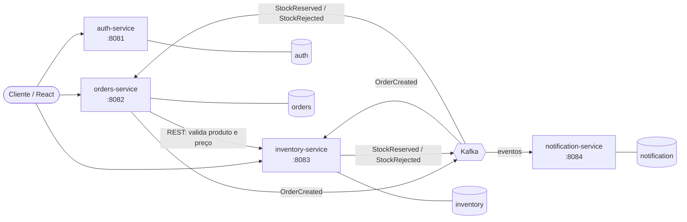

# ecommerce-microservices-java

[](https://github.com/Pedro-G-B-Azevedo/ecommerce-microservices-java/actions/workflows/ci.yml)

Sistema de e-commerce simplificado construído com arquitetura de microsserviços em
Java/Spring Boot, usando PostgreSQL (um banco por serviço), Kafka para comunicação
assíncrona e Docker para orquestração local.

Projeto pessoal de portfólio, desenvolvido em etapas incrementais.

## Arquitetura



O fluxo de criação de pedido é uma **saga coreografada**: o pedido nasce `PENDING`,
o `inventory-service` tenta reservar o estoque e publica o resultado, e o
`orders-service` consome esse retorno para concluir o pedido como `CONFIRMED` ou
`REJECTED`. Os consumidores são idempotentes (deduplicação por id do evento) e
falhas repetidas vão para um *dead-letter topic*.

## Stack

| Camada | Tecnologia |
| --- | --- |
| Linguagem | Java 17 |
| Framework | Spring Boot 3.5 (Web, Data JPA, Validation, Security, Actuator) |
| Persistência | PostgreSQL 16 + Hibernate, migrations com Flyway |
| Mensageria | Apache Kafka (modo KRaft, sem Zookeeper) |
| Comunicação síncrona | `RestClient` (Spring Framework 6) |
| Autenticação | Spring Security + JWT (jjwt), papéis `CLIENTE` e `ADMIN` |
| Documentação | springdoc-openapi (Swagger UI) |
| Testes | JUnit 5, Mockito, Testcontainers, JaCoCo |
| Build | Maven multi-módulo |
| Infra local | Docker Compose |
| CI | GitHub Actions |

## Estrutura do repositório

```
.
├── pom.xml                  # POM pai: versões, plugins e módulos
├── contracts/               # Contratos dos eventos Kafka (compartilhado)
├── auth-service/            # Usuários, papéis e emissão de JWT
├── orders-service/          # Criação e consulta de pedidos
├── inventory-service/       # Estoque e reserva de itens
├── notification-service/    # Notificações a partir dos eventos
├── docker-compose.yml       # Infraestrutura local
└── .github/workflows/ci.yml # Pipeline de build e testes
```

Os serviços compartilham apenas o módulo `contracts`, que contém somente os
*records* dos eventos publicados no Kafka. Entidades JPA, regras de negócio e
DTOs de API **não** são compartilhados: cada serviço é dono do seu domínio e do
seu banco.

## Como executar

### Pré-requisitos

- JDK 17 ou superior
- Docker e Docker Compose
- Não é necessário instalar o Maven: use o wrapper (`./mvnw`)

### Subir a infraestrutura

```bash
cp .env.example .env     # opcional: ajuste usuários e senhas
docker compose up -d
```

Isso sobe um PostgreSQL por serviço:

| Serviço | Banco | Porta do host |
| --- | --- | --- |
| auth-service | `auth` | 5433 |
| orders-service | `orders` | 5434 |
| inventory-service | `inventory` | 5435 |
| notification-service | `notification` | 5436 |

### Build e testes

```bash
./mvnw verify
```

> Os testes usam **Testcontainers** e sobem um PostgreSQL real, portanto o Docker
> precisa estar em execução. As migrations Flyway e o mapeamento Hibernate são
> validados contra o mesmo banco usado em produção — nada de H2.

### Rodar um serviço

```bash
./mvnw -pl orders-service spring-boot:run
```

| Serviço | Porta | Swagger UI |
| --- | --- | --- |
| auth-service | 8081 | http://localhost:8081/swagger-ui.html |
| orders-service | 8082 | http://localhost:8082/swagger-ui.html |
| inventory-service | 8083 | http://localhost:8083/swagger-ui.html |
| notification-service | 8084 | http://localhost:8084/swagger-ui.html |

Cada serviço expõe também `/actuator/health`, `/actuator/info` e `/actuator/metrics`.

As credenciais de banco são lidas de variáveis de ambiente
(`ORDERS_DB_URL`, `ORDERS_DB_USER`, `ORDERS_DB_PASSWORD`, e equivalentes para os
demais serviços), com valores padrão apontando para o `docker-compose.yml`.

## API do orders-service

| Método | Rota | Descrição |
| --- | --- | --- |
| `POST` | `/api/v1/orders` | Cria um pedido (`201` + `Location`). O total é calculado a partir dos itens. |
| `GET` | `/api/v1/orders/{id}` | Busca um pedido com seus itens. |
| `GET` | `/api/v1/orders` | Lista pedidos, com filtros opcionais `customerId` e `status` e paginação. |
| `POST` | `/api/v1/orders/{id}/cancel` | Cancela um pedido que ainda esteja pendente. |

Erros seguem RFC 7807:

```json
{
  "type": "https://api.ecommerce.com/problems/invalid-order-state",
  "title": "Transição de status inválida",
  "status": 409,
  "detail": "Apenas pedidos pendentes podem ser cancelados; status atual: CANCELLED",
  "instance": "/api/v1/orders/edad184c-47e6-4ceb-822f-b578c0910a3c/cancel",
  "timestamp": "2026-01-15T10:00:00Z"
}
```

Dois campos são provisórios e saem em etapas seguintes: `customerId` no corpo da
requisição passa a vir do JWT (etapa 6) e `unitPrice` passa a ser consultado no
inventory-service (etapa 3) — preço não é algo que o cliente deva informar.

## API do inventory-service

| Método | Rota | Descrição |
| --- | --- | --- |
| `POST` | `/api/v1/products` | Cadastra um produto e abre sua linha de estoque. |
| `GET` | `/api/v1/products/{id}` | Busca um produto. |
| `GET` | `/api/v1/products/by-ids?ids=` | Consulta em lote, usada pelo orders-service. |
| `GET` | `/api/v1/products` | Lista produtos, com busca textual e filtro por situação. |
| `GET` | `/api/v1/products/{id}/stock` | Consulta disponível e reservado. |
| `POST` | `/api/v1/products/{id}/stock/replenish` | Dá entrada de estoque. |
| `POST` | `/api/v1/reservations` | Reserva estoque para um pedido (tudo ou nada, idempotente). |
| `GET` | `/api/v1/reservations/{orderId}` | Consulta a reserva de um pedido. |
| `POST` | `/api/v1/reservations/{orderId}/confirm` | Confirma: as unidades saem do estoque. |
| `POST` | `/api/v1/reservations/{orderId}/release` | Libera: as unidades voltam para disponível. |

O estoque tem duas quantidades: `availableQuantity`, o que pode ser vendido agora,
e `reservedQuantity`, o que já foi separado para pedidos ainda não resolvidos.
Reservar move unidades de uma para a outra; confirmar tira as reservadas de vez;
liberar as devolve.

Reservar usa `SELECT ... FOR UPDATE` sobre a linha de estoque. Sem isso, duas
requisições simultâneas leriam a mesma disponibilidade e ambas reservariam,
vendendo estoque que não existe. As linhas são travadas sempre na mesma ordem
(por id do produto), o que elimina a chance de deadlock entre pedidos que
compartilham produtos.

## Convenções

- **Idioma**: identificadores, nomes de classe e mensagens de commit em inglês;
  comentários e documentação em português.
- **Commits**: [Conventional Commits](https://www.conventionalcommits.org/)
  (`feat:`, `fix:`, `chore:`, `test:`, `docs:`, `refactor:`).
- **Pacotes por camada**: `controller`, `service`, `repository`, `entity`, `dto`,
  `exception`, `config`.
- **DTOs sempre**: entidades JPA nunca são expostas nas APIs.
- **Erros**: tratamento centralizado via `@RestControllerAdvice`, com respostas no
  formato [RFC 7807 Problem Details](https://www.rfc-editor.org/rfc/rfc7807).
- **Schema**: o Flyway é o dono do schema; o Hibernate roda com `ddl-auto: validate`.

## Decisões de arquitetura

| Decisão | Motivo |
| --- | --- |
| Maven multi-módulo | Build e pipeline únicos, versões de dependências alinhadas em um só lugar, sem acoplar os serviços em tempo de execução. |
| Módulo `contracts` | Evita duplicar o contrato dos eventos entre produtor e consumidores, sem virar uma biblioteca de domínio compartilhado. |
| Importar o BOM em vez de herdar `spring-boot-starter-parent` | O POM raiz não é um projeto Spring Boot; ele apenas agrega módulos e gerencia versões. |
| Kafka em modo KRaft | O Zookeeper foi removido no Kafka 4.0; usá-lo em um projeto novo seria legado. |
| Saga coreografada | Um pedido só é confirmado depois que o estoque responde — modela de verdade a consistência eventual entre serviços. |
| Testcontainers desde o início | Testar com H2 e implantar em PostgreSQL esconde divergências de dialeto, tipos e migrations. |
| `RestClient` em vez de OpenFeign | O Spring Cloud OpenFeign está em modo manutenção; o `RestClient` é nativo do Spring Framework. |

## Roadmap

- [x] **1.** Setup do projeto: estrutura multi-módulo, POMs, Docker Compose com os bancos, CI
- [x] **2.** `orders-service`: entidades, CRUD, DTOs, tratamento de erros e testes
- [x] **3.** `inventory-service`: produtos, estoque e reserva
- [ ] **4.** Integração via Kafka entre `orders` e `inventory` (saga, idempotência, DLT)
- [ ] **5.** `notification-service` consumindo os eventos
- [ ] **6.** `auth-service`: Spring Security + JWT, papéis `CLIENTE`/`ADMIN`
- [ ] **7.** Documentação OpenAPI completa
- [ ] **8.** Testes de integração ponta a ponta
- [ ] **9.** Dockerfiles e Docker Compose completo
- [ ] **10.** Pipeline de CI/CD com build de imagens
- [ ] **11.** Observabilidade: correlation id, métricas e logs estruturados *(opcional)*
- [ ] **12.** Front-end em React *(opcional)*

## Licença

[MIT](LICENSE)
